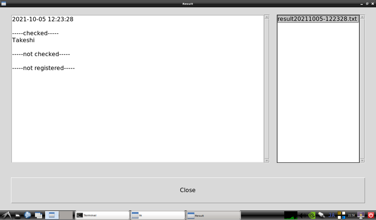

# Face-Check

This project offers a simple face recognition application using [facenet-pytorch](https://github.com/timesler/facenet-pytorch) with user-friendly GUI. This is designed for actual and practical use where you need to check specific people like your colleagues, friends, and family members.

## Requirement

This application is supporsed to run on NVIDIA Jetson Nano. Here is the detail.

* NVIDIA Jetson Nano Developer Kit
* NVIDIA JetPack 5.0 (6.0 compatible is coming soon)
* USB Web Camera or Raspberry Pi Camera module V2

### Display

The app's layout is optimized for 7 inch touch display (1024x600). But any larger display can be used.

## How to start

To install

~~~
git clone https://github.com/take5553/face-check.git
cd face-check
chmod +x run.sh
~~~

To run

~~~
./run.sh
~~~

**It will take a long time to start this app.** And make sure your camera is connected to Jetson.

## Window Introduction

After the app is launched, you will see Main window which has six buttons. For your first time to run this app, just follow the numbers 1 to 4.

**1(Face Register) and 3(Recognition) take time to open window. Please be patient.**

### 1. Face Register

Put your name in the text box and push "Take a pic" button. If you want to make sure you are close enough to the camera, push "Detection ON" and confirm the red rectangle appearing around your face.

Picture resolution depends on your camera. But the resolution is automatically selected as long as you don't change the config.

One picture per a person is enough.

### 2. Registered Pics

You can check your registered pictures. If you are not satisfied with the picture, delete it on this window and take another picture on "Face Register" window.

### 3. Recognition

Push "Start" button to start recognition.

During the recognition, your registered name is displayed with the probability when the app recognize you. If you are recognized in 9 frames out of 10, you are confirmed and registered "confirmed list" in the left side of the window. Once you are confirmed, you will not be confirmed again unless you push "Finish Check" button.

If multiple faces are registered and the app mistakenly recognize you as another person, you can delete the recognition by clicking the wrong recognition from the checked list and pushing "Delete" button.

### 4. Result

You can check the result on Result window, which you can go from Main window.

* checked: confirmed on Recognition window.
* not checked: not confirmed.
* not registered: the people who are on `checklist.txt`(explanation is given below) but not taken the face picture. This list don't have any names for regular use.

## Config

You can adjust configurations. The config window is like this. The options may change as the version increases.

### Capture tab

* `Device` : the device id and camera connection, csi or usb.
* `Resolution` : the resolution set which the camera can process. This is automatically detected.
* `Rotation` : to give the direction of rotation.

### Canvas tab

* `Width x Height` : the size of video and picture. If the camera resolution is larger than this size, then captured images are cropped before displayed.
* `Update Interval` : the duration the app update the captured image. This doesn't mean the exact interval of image update.

### Save Settings tab

* `Save Directory` : the main directory in which  face images and recognition sounds are saved.
* `Face Images Directory` : the directory for captured images. This is made under the `Save Directory`.
* `Result Save Directory` : the directory for the result file. This is not limited under the `Save Directory` in case you want to send result files to somewhere else.

### Recognition tab

* `Confirmation Sound` : the file to the sound which is played after confirmation to indicate recognition is completed. The available file extentions are what GStreamer can play. (I tested `.wav` and `.mp3` and they worked.)

  Note: If the sound isn't played, check the setting below
  ~~~
  Start button -> Sound & Video -> PulseAudio Volume Control -> Configuration

  Built-in Audio(The second one): Off
  ~~~

  

### Window Settings tab

* `Fullscreen` : to switch fullscreen or not.
* `Font Size` : the font size which is applied to all windows.

## Hacking tips

(under construction)

## Motivation

In the lunch break of my workplace, employees who ordered their lunch box in the morning check their names with a marker pen to confirm "I exactly ordered the lunch box" and "I took it." It takes a little time because they have to put off the cap of the pen, look for their name, check it and put the cap back. It's a little but it makes a queue.

This small problem ignited this project. I made this app available for more general purposes as well.

The most important point of this application is that it is easy to use, even for people who are not familiar with Linux, Python or Jupyter. Once this app is up and running, you won't have any trouble using it with its familiar GUI and simple controls. This simplicity brings convenience and applicability wherever it is needed.

## Reference

* JetCam  
  [https://github.com/NVIDIA-AI-IOT/jetcam](https://github.com/NVIDIA-AI-IOT/jetcam)

* Face Recognition Using Pytorch  
  [https://github.com/timesler/facenet-pytorch](https://github.com/timesler/facenet-pytorch)

## Licence

Copyright (c) 2021 Takeshi Yamazaki  
Released under the MIT license  
See LICENSE

Twitter: [Take555](https://twitter.com/Tak5553)